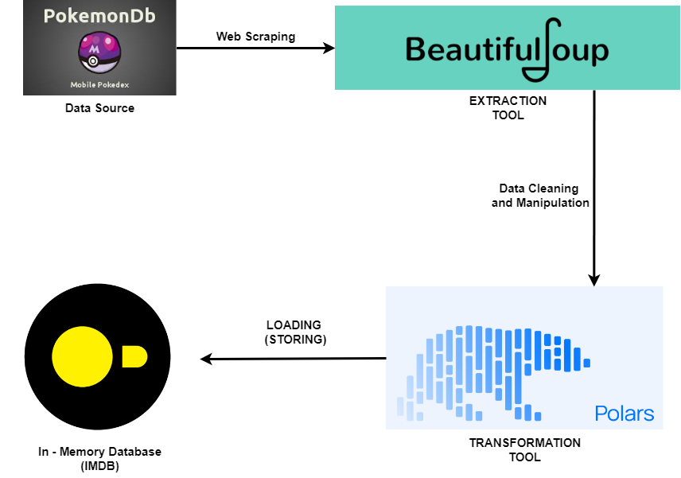

#WEB SCRAPING PROJECT

This project is a challenge posted by sir Josh Dev at the PyData group
Data Engineering Pilipinas (DEP).

The challenge is that you must web scrape the data from pokemondb.net
then store it to a database. 

This replicates a basic ETL/ELT pipeline where a data engineer extracts
the data (web scraping) then transform (clean and sanitize) the data so 
that it is readable and unifrom. Finaly, store the data in a database

